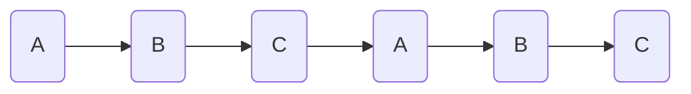

# 平滑加权轮询算法

## 0x01 轮询

假设现在有三台服务器（A、B、C），并配置了负载均衡来进行轮询，也就是让客户端发送的请求依次发送给A、B、C。则请求情况是：

但是实际中会存在服务器性能不一的问题，比如A服务器性能强，所以它需要处理更多的请求，因此需求的情况是：

~~~mermaid
graph LR
a1(A)-->a2(A)-->b1(B)-->c1(C)-->a4(A)-->a47(A)-->b2(B)-->c2(C)
~~~

而对应到代码中，就是给每台服务器设置一个权重，如：A（2）、B（1）、C（1），让请求根据权重发送给服务器，这样一来，就可以实现上述中的需求情况，此时的权重是静态的。

## 0x02 新的问题

但在实际情况中，为了实现细颗粒度的需求，权重一般是一个很大的数值，如A(500)、B(1)、C(1)，此时轮询就会变成这样：

~~~mermaid
graph LR
1(A)-->2(A)-->3(A)-->4(A)-->5(A)-->6(......)-->7(B)-->8(C)
~~~

也就形成了新的问题——单点过热。

这时静态权重就显示出了它的局限性，就需要通过一系列的算法计算出动态权重，并通过动态权重来进行`平滑轮询`。

